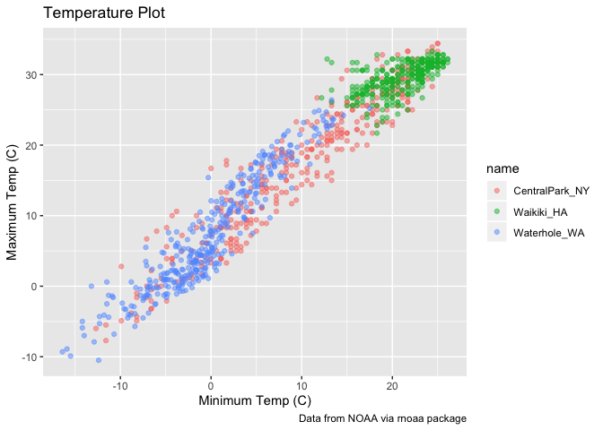
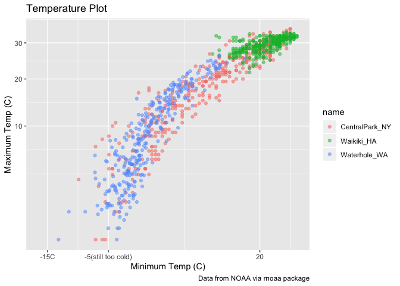
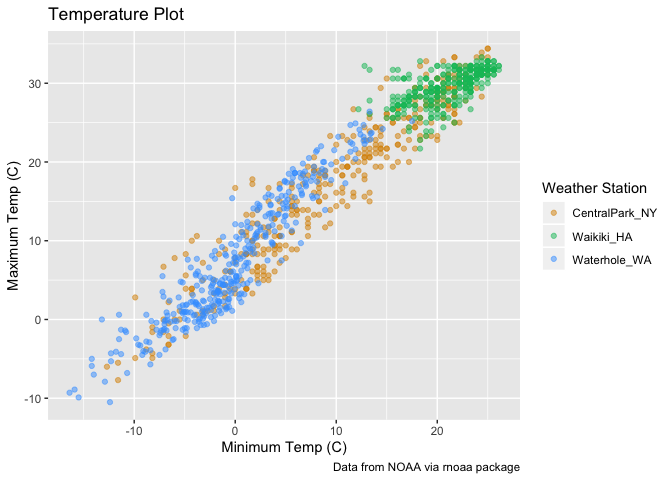
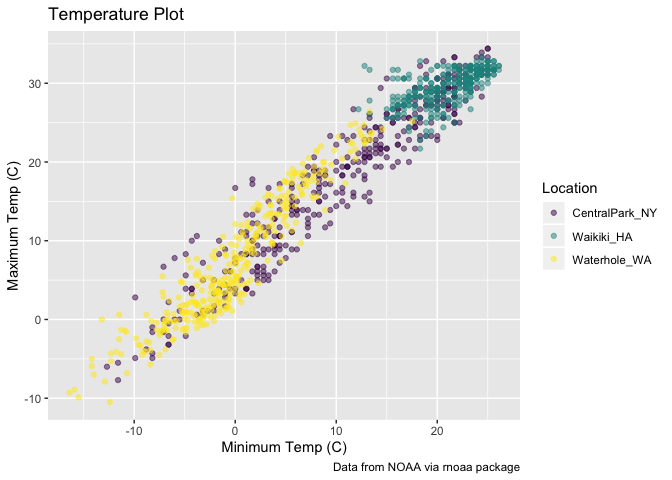
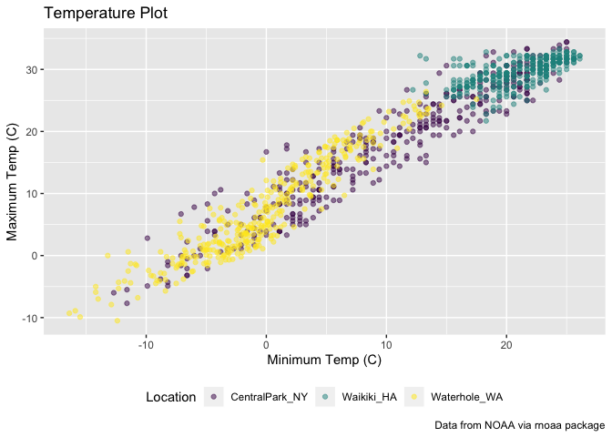
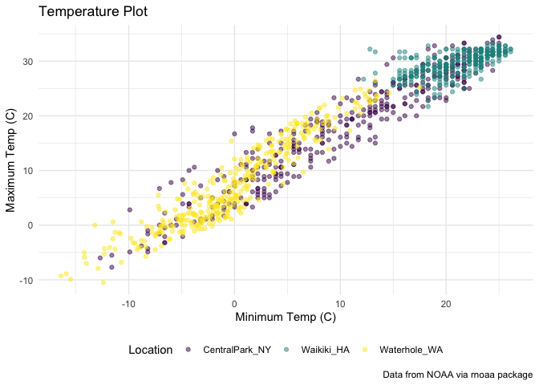
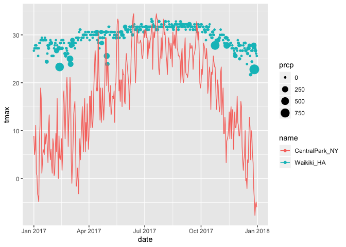
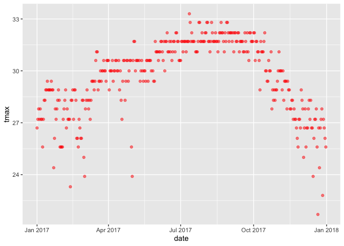

ggplot
================

``` r
weather_df = 
  rnoaa::meteo_pull_monitors(c("USW00094728", "USC00519397", "USS0023B17S"),
                      var = c("PRCP", "TMIN", "TMAX"), 
                      date_min = "2017-01-01",
                      date_max = "2017-12-31") %>%
  mutate(
    name = recode(id, USW00094728 = "CentralPark_NY", 
                      USC00519397 = "Waikiki_HA",
                      USS0023B17S = "Waterhole_WA"),
    tmin = tmin / 10,
    tmax = tmax / 10) %>%
  select(name, id, everything())
```

    ## Registered S3 method overwritten by 'crul':
    ##   method                 from
    ##   as.character.form_file httr

    ## Registered S3 method overwritten by 'hoardr':
    ##   method           from
    ##   print.cache_info httr

    ## file path:          /Users/kellychen/Library/Caches/rnoaa/ghcnd/USW00094728.dly

    ## file last updated:  2019-09-26 10:26:37

    ## file min/max dates: 1869-01-01 / 2019-09-30

    ## file path:          /Users/kellychen/Library/Caches/rnoaa/ghcnd/USC00519397.dly

    ## file last updated:  2019-09-26 10:26:46

    ## file min/max dates: 1965-01-01 / 2019-09-30

    ## file path:          /Users/kellychen/Library/Caches/rnoaa/ghcnd/USS0023B17S.dly

    ## file last updated:  2019-09-26 10:26:49

    ## file min/max dates: 1999-09-01 / 2019-09-30

create a ggplot
---------------

``` r
ggplot(weather_df, aes(x= tmin, y = tmax)) + #definding the dataset itself, what's the x-axis, and what's the y-axis;
  geom_point()
```

    ## Warning: Removed 15 rows containing missing values (geom_point).

 saving initial plots

``` r
#weather_df %>% filter(name ==)
scatterplot = 
   weather_df %>% 
  ggplot(aes(x= tmin, y = tmax)) + geom_point()

scatterplot
```

    ## Warning: Removed 15 rows containing missing values (geom_point).


adding color

``` r
weather_df %>% 
  ggplot(aes(x= tmin, y = tmax)) + 
  geom_point(aes(color=name), alpha = 0.4) #alpha statemtn: adjusting the transparency, range[0,1]
```

    ## Warning: Removed 15 rows containing missing values (geom_point).

 why do 'aes' positions matter?

``` r
weather_df %>% 
  ggplot(aes(x= tmin, y = tmax)) + 
  geom_point(aes(color=name), alpha = 0.4) +
  geom_smooth(se.=FALSE) #giving a smooth curve about the scatterplot; #se.=FALSE about confidence interval
```

    ## Warning: Ignoring unknown parameters: se.

    ## `geom_smooth()` using method = 'gam' and formula 'y ~ s(x, bs = "cs")'

    ## Warning: Removed 15 rows containing non-finite values (stat_smooth).

    ## Warning: Removed 15 rows containing missing values (geom_point).

 vs.

``` r
weather_df %>% 
  ggplot(aes(x= tmin, y = tmax, color = name)) + 
  geom_point(alpha = 0.4) +
  geom_smooth(se = FALSE)  #giving a smooth curve about the scatterplot; #se =FALSE:get rid of the confidence interval shown in the graph
```

    ## `geom_smooth()` using method = 'loess' and formula 'y ~ x'

    ## Warning: Removed 15 rows containing non-finite values (stat_smooth).

    ## Warning: Removed 15 rows containing missing values (geom_point).


``` r
  facet_grid(~ name) #facet_grid: separate the data by name
```

    ## <ggproto object: Class FacetGrid, Facet, gg>
    ##     compute_layout: function
    ##     draw_back: function
    ##     draw_front: function
    ##     draw_labels: function
    ##     draw_panels: function
    ##     finish_data: function
    ##     init_scales: function
    ##     map_data: function
    ##     params: list
    ##     setup_data: function
    ##     setup_params: function
    ##     shrink: TRUE
    ##     train_scales: function
    ##     vars: function
    ##     super:  <ggproto object: Class FacetGrid, Facet, gg>

``` r
weather_df %>% 
  ggplot(aes(x = date, y = tmax, color = name)) +
  geom_point() +
  geom_smooth(se = FALSE)
```

    ## `geom_smooth()` using method = 'loess' and formula 'y ~ x'

    ## Warning: Removed 3 rows containing non-finite values (stat_smooth).

    ## Warning: Removed 3 rows containing missing values (geom_point).


``` r
ggplot(weather_df, aes(x = date, y = tmax, color = name)) + 
  geom_smooth(size =2, se = FALSE) 
```

    ## `geom_smooth()` using method = 'loess' and formula 'y ~ x'

    ## Warning: Removed 3 rows containing non-finite values (stat_smooth).


2d density

``` r
weather_df %>% 
  ggplot(aes(x = tmin, y = tmax)) +
  geom_bin2d()
```

    ## Warning: Removed 15 rows containing non-finite values (stat_bin2d).


``` r
  #geom_hex(): after install.packages("hexbin")
```

more kinds of plots!
--------------------

``` r
weather_df %>% 
  ggplot(aes(x = tmax, fill = name)) + #color: tells you the bar outside, if you want to color the inside part, use fill
  geom_histogram() +
  facet_grid(~name)
```

    ## `stat_bin()` using `bins = 30`. Pick better value with `binwidth`.

    ## Warning: Removed 3 rows containing non-finite values (stat_bin).


``` r
weather_df %>% 
  ggplot(aes(x = tmax, fill = name)) +
  geom_density(alpha = 0.3) 
```

    ## Warning: Removed 3 rows containing non-finite values (stat_density).


``` r
  #facet_grid(~name)
```

``` r
  ggplot(weather_df, aes(x = name, y = tmax)) + geom_boxplot()
```

    ## Warning: Removed 3 rows containing non-finite values (stat_boxplot).


``` r
ggplot(weather_df, aes(x = name, y = tmax)) + 
  geom_violin(aes(fill = name), color = "blue", alpha = .5) + 
  stat_summary(fun.y = median, geom = "point", color = "blue", size = 4)
```

    ## Warning: Removed 3 rows containing non-finite values (stat_ydensity).

    ## Warning: Removed 3 rows containing non-finite values (stat_summary).


``` r
weather_df %>% 
ggplot(aes(x = tmax, y = name)) + 
  geom_density_ridges(scale = .85)
```

    ## Picking joint bandwidth of 1.84

    ## Warning: Removed 3 rows containing non-finite values (stat_density_ridges).


saving a plot
-------------

``` r
ggp_ridge_temp = 
  weather_df %>% 
  ggplot(aes( x= tmax, y= name)) +
  geom_density_ridges()

ggsave("ggplot_temp_ridge.pdf",
       ggp_ridge_temp)
```

    ## Saving 7 x 5 in image

    ## Picking joint bandwidth of 1.84

    ## Warning: Removed 3 rows containing non-finite values (stat_density_ridges).

``` r
weather_df %>% 
  ggplot(aes(x = date, y = tmax, color = name)) +
  geom_point(alpha = 0.4) +
  geom_smooth(se = FALSE)
```

    ## `geom_smooth()` using method = 'loess' and formula 'y ~ x'

    ## Warning: Removed 3 rows containing non-finite values (stat_smooth).

    ## Warning: Removed 3 rows containing missing values (geom_point).


Making more plots
-----------------

``` r
weather_df %>% 
  ggplot (aes(x = tmin, y = tmax, color = name)) +
  geom_point(alpha = 0.5)
```

    ## Warning: Removed 15 rows containing missing values (geom_point).


adding labels:

``` r
weather_df %>% 
  ggplot (aes(x = tmin, y = tmax, color = name)) +
  geom_point(alpha = 0.5) +
  labs(
    title = "Temperature Plot",
    x = "Minimum Temp (C)",
    y = "Maximum Temp (C)",
    caption = "Data from NOAA via rnoaa package"
    )
```

    ## Warning: Removed 15 rows containing missing values (geom_point).



x axis tick marks etc

``` r
weather_df %>% 
  ggplot (aes(x = tmin, y = tmax, color = name)) +
  geom_point(alpha = 0.5) +
  labs(
    title = "Temperature Plot",
    x = "Minimum Temp (C)",
    y = "Maximum Temp (C)",
    caption = "Data from NOAA via rnoaa package"
  ) +
  scale_x_continuous(
    breaks = c(-15, -5, 20),
    labels = c("-15C", "-5(still too cold)", "20")
  ) +
  scale_y_sqrt()
```

    ## Warning in self$trans$transform(x): NaNs produced

    ## Warning: Transformation introduced infinite values in continuous y-axis

    ## Warning: Removed 90 rows containing missing values (geom_point).



``` r
#scale_y_continuous( trans = "sqrt") doing the same thing: transforming the function into the sqaure root
```

change the default color using scale\_color\_hue

``` r
weather_df %>% 
  ggplot (aes(x = tmin, y = tmax, color = name)) +
  geom_point(alpha = 0.5) +
  labs(
    title = "Temperature Plot",
    x = "Minimum Temp (C)",
    y = "Maximum Temp (C)",
    caption = "Data from NOAA via rnoaa package"
  ) +
  scale_color_hue(
    name = "Weather Station", #naming the color reference table, called legand
    h = c(50,250) #changing the value here to adjust the color of the plot
  )
```

    ## Warning: Removed 15 rows containing missing values (geom_point).



``` r
ggp_base = 
weather_df %>% 
  ggplot (aes(x = tmin, y = tmax, color = name)) +
  geom_point(alpha = 0.5) +
  labs(
    title = "Temperature Plot",
    x = "Minimum Temp (C)",
    y = "Maximum Temp (C)",
    caption = "Data from NOAA via rnoaa package"
  ) +
 viridis::scale_color_viridis(
    name = "Location", 
    discrete = TRUE
 )

ggp_base
```

    ## Warning: Removed 15 rows containing missing values (geom_point).



themes
------

``` r
ggp_base +
  theme (legend.position = "bottom") #put the legend on the bottom of the plot
```

    ## Warning: Removed 15 rows containing missing values (geom_point).



``` r
ggp_base +
  theme_minimal() + #erasing the grey background color
  theme(legend.position = "bottom")
```

    ## Warning: Removed 15 rows containing missing values (geom_point).



``` r
#the order matters! if do the theme(legend.position) first, the plot will first put the legend on the bottom, but when it goes to the next argument, the theme_Minimal, the legend will go back on the right side of the plot.
```

``` r
weather_df %>% 
  filter(is.na(tmin))
```

    ## # A tibble: 15 x 6
    ##    name       id          date        prcp  tmax  tmin
    ##    <chr>      <chr>       <date>     <dbl> <dbl> <dbl>
    ##  1 Waikiki_HA USC00519397 2017-04-17     5  28.3    NA
    ##  2 Waikiki_HA USC00519397 2017-05-09    NA  NA      NA
    ##  3 Waikiki_HA USC00519397 2017-05-26    NA  NA      NA
    ##  4 Waikiki_HA USC00519397 2017-07-19    NA  NA      NA
    ##  5 Waikiki_HA USC00519397 2017-10-07     0  31.1    NA
    ##  6 Waikiki_HA USC00519397 2017-10-09     0  28.9    NA
    ##  7 Waikiki_HA USC00519397 2017-10-10    10  31.7    NA
    ##  8 Waikiki_HA USC00519397 2017-10-12     0  31.1    NA
    ##  9 Waikiki_HA USC00519397 2017-10-13     0  31.1    NA
    ## 10 Waikiki_HA USC00519397 2017-10-16     5  30      NA
    ## 11 Waikiki_HA USC00519397 2017-10-18     0  29.4    NA
    ## 12 Waikiki_HA USC00519397 2017-10-20    13  30.6    NA
    ## 13 Waikiki_HA USC00519397 2017-10-21     0  30      NA
    ## 14 Waikiki_HA USC00519397 2017-10-22     0  30      NA
    ## 15 Waikiki_HA USC00519397 2017-12-22     0  26.7    NA

more than one dataset
---------------------

``` r
central_park = 
  weather_df %>% 
  filter (name == "CentralPark_NY")

waikiki = 
  weather_df %>% 
  filter (name == "Waikiki_HA")

ggplot(data = waikiki, aes (x = date, y = tmax, color = name)) +
  geom_point(aes(size = prcp)) +
  geom_line(data = central_park)
```

    ## Warning: Removed 3 rows containing missing values (geom_point).



bried aside about colors

``` r
waikiki %>% 
  ggplot(aes (x = date, y = tmax)) + #to make the color red
  geom_point(alpha = 0.5, color = "red") 
```

    ## Warning: Removed 3 rows containing missing values (geom_point).



``` r
  # to get the specific color plots by stating it on geom_point under color statement
```
